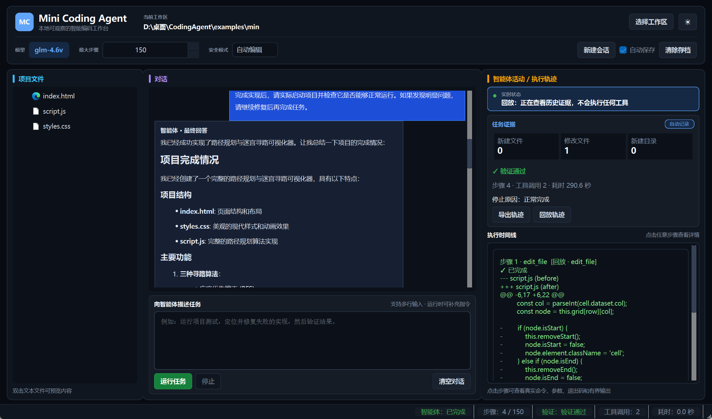
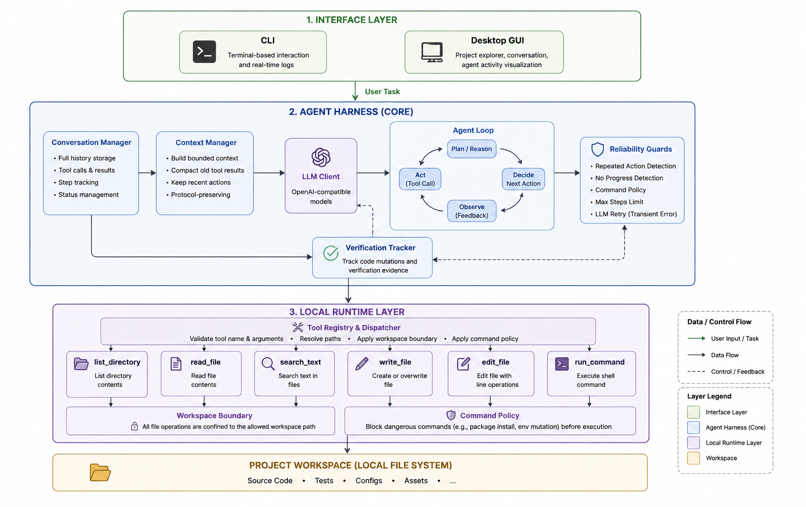
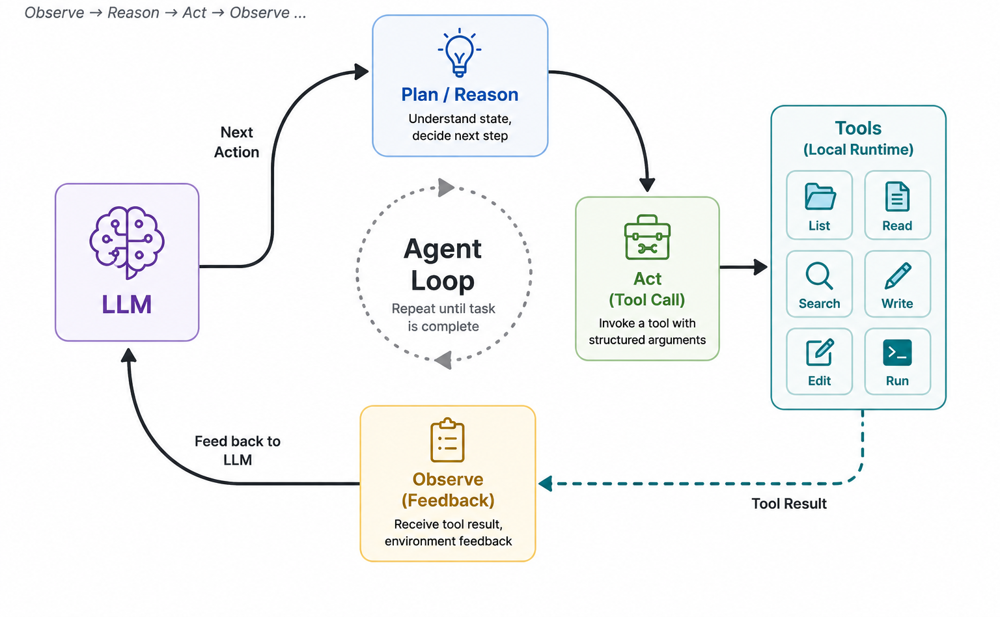
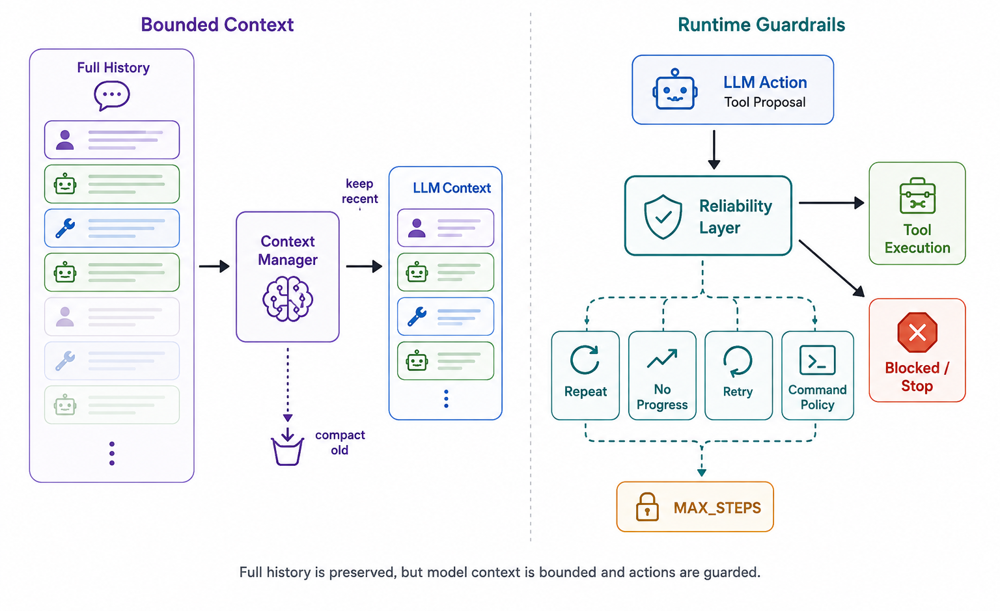
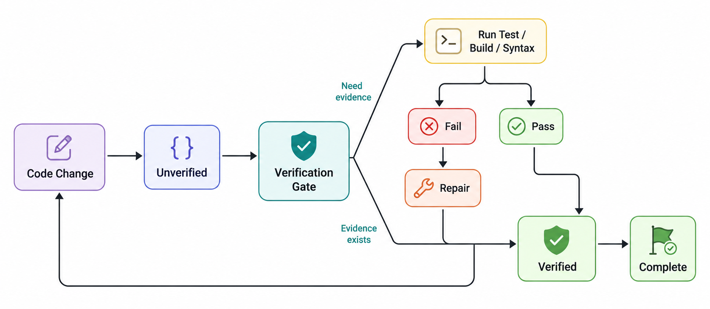
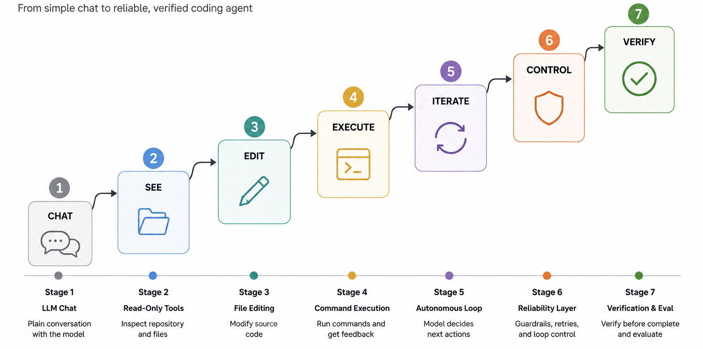

# Mini Coding Agent

<p align="center">
  <strong>一个从零实现、由真实执行反馈驱动、可观察且具备验证意识的本地 Coding Agent。</strong><br>
  <em>A framework-free, execution-grounded and observable coding agent built directly in Python.</em>
</p>

<p align="center">
  <a href="https://github.com/IPOTATOOOI/CodingAgent/actions/workflows/ci.yml"></a>
  
  
  
</p>



Mini Coding Agent 中，模型每一步都根据真实工具结果决定下一步；Runtime 负责上下文边界、工具分发、可靠性约束、命令策略和完成验证；CLI 与桌面 GUI 提供同一套 Agent Runtime 的两个交互入口。

Mini Coding Agent is not a chat window wrapped around a fixed workflow. Each model decision is grounded in real tool results, while the Runtime owns context bounds, tool dispatch, reliability policies, command control and completion verification. The CLI and desktop GUI are two interfaces over the same Agent Runtime.

## Why Mini Coding Agent?

普通 LLM 对话可以建议如何修改代码，但一个 Coding Agent Harness 还必须把“建议”变成受控、可观察、可验证的本地执行过程。

A regular LLM chat can suggest a fix. A coding-agent harness must turn that suggestion into a controlled, observable and verifiable local execution process.

| 普通代码对话 / Plain coding chat | Mini Coding Agent Harness |
| --- | --- |
| 根据文本猜测项目状态 / Infers state from text | 通过文件和命令工具观察真实项目 / Observes the real project through tools |
| 给出一次性答案 / Produces a one-shot answer | 根据新 Observation 持续选择下一步 / Chooses the next action from fresh observations |
| 依赖 Prompt 约束行为 / Relies mainly on prompting | 在 Runtime 中执行确定性策略 / Enforces deterministic Runtime policies |
| 修改后即可声称完成 / May claim completion after editing | 支持的代码修改必须获得执行证据 / Requires execution evidence for supported mutations |
| 长对话直接塞入 Prompt / Sends growing history directly | 保留完整历史，同时构建有界模型上下文 / Preserves full history while bounding model context |

## Highlights

| Highlight | 工程含义 / Engineering meaning |
| --- | --- |
| **① Built from Scratch**<br>**Framework-free Agent Harness** | Agent Loop、Conversation、Tool Dispatch、Context Management、Reliability 和执行控制均直接使用 Python 实现。<br><br>The core loop, conversation state, tool dispatch, context management, reliability policies and execution control are implemented directly in Python. |
| **② Feedback-driven Autonomy**<br>**Execution feedback drives the next action** | 流程不是硬编码的 `read → edit → test`。每次 Tool Result 都成为新的 Observation，由模型重新决定后续动作。<br><br>The workflow is not hard-coded. Every tool result becomes a new observation that drives the next model decision. |
| **③ Bounded Context**<br>**Full history, bounded model context** | Runtime 保存完整 Conversation，但只向模型发送经过协议安全压缩的有界视图。<br><br>The Runtime preserves complete history while sending only a bounded, protocol-safe view to the model. |
| **④ Runtime Reliability**<br>**Runtime guardrails, not prompt-only safety** | 重复动作、无进展、重试、最大步骤和危险命令由确定性 Runtime Policy 处理。<br><br>Repeated actions, no-progress loops, retries, step bounds and dangerous commands are handled by deterministic Runtime policies. |
| **⑤ Verification-aware Completion**<br>**An edit is an action, not proof of correctness.** | 修改会产生新的 mutation generation；只有获得匹配的测试、构建或语法检查证据后，支持的代码任务才能完成。<br><br>A mutation creates a new generation. Supported code tasks complete only after matching test, build or syntax-check evidence exists. |

## How It Works



整体分为三层：Interface Layer 提供 CLI 与 PySide6 GUI；Agent Harness 负责对话、上下文、决策循环、可靠性与验证；Local Runtime 将结构化 Tool Call 落到受 Workspace Boundary 和 Command Policy 约束的真实文件系统与进程。

The system has three layers: the Interface Layer provides CLI and PySide6 GUI; the Agent Harness owns conversation, context, decision loops, reliability and verification; the Local Runtime maps structured tool calls to the real filesystem and processes under workspace and command policies.

### Autonomous control loop / 自主控制循环



一次 LLM Response 算一个 Agent Step；同一 Response 可以提出多个结构化 Tool Call，这些工具按顺序执行并作为完整 Tool Result 组追加到 Conversation，然后才开始下一步。工具失败是 Observation，而不是自动终止条件：例如测试退出码为 1 可以驱动读取错误、修改实现并重新验证。

One LLM response is one agent step. A response may request multiple structured tool calls; they execute sequentially and their results are appended as a complete protocol group before the next decision. Tool failure is an observation, not an automatic stop condition: a failing test can drive inspection, repair and another verification run.

### Context and reliability / 上下文与可靠性



`ContextManager` 在每次模型请求前构建有界视图，默认上限为 60,000 字符和估算 16,000 tokens，并优先保留 System 指令、当前任务和最近 12 个协议组。Assistant Tool Call 与随后的 Tool Results 会作为一个整体保留、压缩或移除，不会破坏原生 Tool Calling 关系。

Before every model request, `ContextManager` builds a bounded view with default budgets of 60,000 characters and an estimated 16,000 tokens. System instructions, the current task and the latest 12 protocol groups are prioritized. Assistant tool calls and their following tool results are retained, compacted or removed as a unit.

可靠性是一组运行时规则：

Runtime reliability is a set of enforceable rules, not a single prompt instruction:

- 第 3 次连续相同动作在执行前返回 `RepeatedAction`。<br>
  The third consecutive identical action is rejected before execution.
- Workspace 未变化时，相同只读 Observation 返回 `RepeatedObservation`。<br>
  Duplicate read-only observations are skipped while the workspace is unchanged.
- 连续读取过多会触发 progress warning；连续 4 个 Step 没有新 Observation 或有效修改会以 `no_progress` 停止。<br>
  Excessive inspection emits progress guidance; four no-progress steps terminate with `no_progress`.

### Verification-aware completion / 验证感知的完成条件



> **Mutation → Verification → Completion**<br>
> **修改 → 验证 → 完成**

成功执行 `write_file` 或 `edit_file` 只说明文件写入成功。对受支持的源码和项目配置修改，Runtime 会将最新 mutation generation 标为 `unverified`；只有能覆盖待验证路径的测试、构建或语法检查以退出码 0 完成后，最终回答才会被接受为 `completed`。

A successful `write_file` or `edit_file` call proves only that bytes were written. For supported source and project-configuration changes, the Runtime marks the latest mutation generation as `unverified`. A final response is accepted as `completed` only after a recognized test, build or syntax check covers the pending paths and exits successfully.

窄范围证据可以累计；验证通过后再次修改会创建新 generation 并要求重新验证；纯 `.md`、`.txt`、`.rst` 文档修改不触发代码验证门。

Narrow evidence may accumulate. A mutation after a successful check creates a new generation and requires new evidence. Documentation-only `.md`, `.txt` and `.rst` changes bypass the code gate.

## End-to-End Example / 端到端示例

用户不需要指定固定流程，只需描述目标：

The user describes the goal rather than prescribing a fixed workflow:

```text
Run the project tests, locate the failing implementation,
fix the problem, and verify the result.

Step 1  run_command     tests fail, exit_code = 1
Step 2  read_file       inspect the relevant implementation
Step 3  edit_file       apply a bounded code change
Step 4  run_command     tests pass, exit_code = 0
Gate    verification    verified
Final   Agent response  completed with execution evidence
```

模型也可以根据 Observation 选择搜索、浏览其他目录、创建缺失文件，或在验证失败后继续修复；Runtime 并未硬编码上述顺序。

The model may instead search, inspect other directories, create missing files or continue repairing after failed verification. The Runtime does not hard-code the sequence above.

## Installation & Usage / 安装与使用

### Requirements / 环境要求

- Python 3.10 or newer / Python 3.10 及以上
- An OpenAI-compatible Chat Completions API / 兼容 OpenAI 的 Chat Completions API

```bash
pip install -e .
```

安装测试依赖 / Install test dependencies:

```bash
pip install -e ".[test]"
```

### Configuration / 配置

复制 `.env.example` 为 `.env`，或设置同名系统环境变量：

Copy `.env.example` to `.env`, or define the same values as environment variables:

```dotenv
LLM_API_KEY=your-api-key
LLM_MODEL=your-model
LLM_BASE_URL=https://your-compatible-provider.example/v1
```

`LLM_API_KEY` 与 `LLM_MODEL` 必填，`LLM_BASE_URL` 可选。系统环境变量优先于 `.env`。

`LLM_API_KEY` and `LLM_MODEL` are required; `LLM_BASE_URL` is optional. Environment variables override `.env`. The `.env` file is Git-ignored and real credentials must never be committed.

### Desktop GUI / 桌面界面

```bash
python -m coding_agent.gui --workspace examples/demo_project --max-steps 20
```

安装后也可以使用入口命令 / Installed entry point:

```bash
coding-agent-gui --workspace examples/demo_project --max-steps 20
```

### CLI / 命令行

```bash
python -m coding_agent --workspace examples/demo_project --max-steps 20
```

安装后也可以使用 / Installed entry point:

```bash
coding-agent --workspace examples/demo_project --max-steps 20
```

## Tool Reference & Safety Model / 工具与安全模型

| Tool | Current semantics / 当前语义 |
| --- | --- |
| `list_directory` | 列出 Workspace 内目录的直接子项 / List direct entries inside the workspace |
| `read_file` | 按行读取受限大小的 UTF-8 文本 / Read bounded UTF-8 text with line metadata |
| `search_text` | 在 Workspace 内进行有界字面文本搜索 / Bounded literal search inside the workspace |
| `create_directory` | 显式创建目录并安全补齐缺失父目录 / Create a directory and missing parents safely |
| `write_file` | 只创建新文件并补齐父目录；拒绝覆盖 / Create new files and parents; never overwrite |
| `edit_file` | 仅在 `old_text` 唯一匹配时执行精确替换 / Replace only when `old_text` matches exactly once |
| `run_command` | 使用参数数组、`shell=False` 和 Workspace-scoped `cwd` 执行非交互命令 / Execute non-interactive commands with argument arrays, `shell=False` and workspace-scoped `cwd` |

## Project Structure / 项目结构

```text
CodingAgent/
├── src/coding_agent/
│   ├── agent.py              # autonomous loop and stop reasons
│   ├── conversation.py       # full protocol-safe history
│   ├── context.py            # bounded LLM-visible context
│   ├── reliability.py        # repeat/no-progress policies
│   ├── verification.py       # mutation generations and evidence gate
│   ├── approval.py           # Read Only / Ask / Auto Edit / Auto
│   ├── evidence.py           # structured task evidence
│   ├── session.py            # bounded durable conversations
│   ├── tools/                # filesystem, command and registry
│   └── gui/                  # PySide6 view layer and QThread worker
├── tests/                    # deterministic unit and integration tests
├── eval/                     # six real-LLM fixtures and independent verifiers
├── examples/demo_project/    # safe demonstration workspace
├── DESIGN.md                 # detailed design decisions
└── pyproject.toml            # package metadata and entry points
```

## Tests & CI / 测试与持续集成

```bash
python -m unittest discover -s tests -v
python -m compileall -q src tests eval
```

## Design Evolution / 设计演进



项目沿着可验证的能力边界逐步演进：

The project evolved through testable capability boundaries:

```text
INIT → CHAT → SEE → EDIT → EXECUTE → ITERATE → CONTROL → VERIFY
```

| Stage | Capability / 能力 |
| --- | --- |
| 0 | Project initialization and CLI skeleton / 项目初始化与 CLI 骨架 |
| 1 | LLM chat and conversation / LLM 对话与会话状态 |
| 2 | Read-only local observation / 只读本地观察 |
| 3 | Bounded file editing / 有边界的文件编辑 |
| 4 | Local command execution and feedback / 本地命令执行与反馈 |
| 5 | Autonomous observation-action loop / 自主观察—行动循环 |
| 6 | Context, reliability and Runtime safety / 上下文、可靠性与运行时安全 |
| 7 | Verification and independent evaluation / 完成验证与独立评估 |
| 8–9 | Observable GUI, Evidence, approval, streaming and durable sessions / 可观察 GUI、证据、授权、流式交互与持久会话 |

更完整的设计权衡、协议和安全边界见 [`DESIGN.md`](./DESIGN.md)。

See [`DESIGN.md`](./DESIGN.md) for detailed trade-offs, protocols and safety boundaries.
